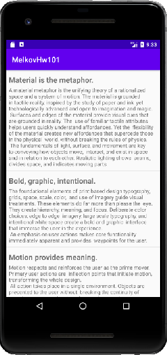

## Задача № 1
### Отображение списка
Редкое приложение обходится без отображения списка. Это один из самых популярных компонентов в тестовых заданиях и очень популярный вопрос на собеседованиях.

**Задание**: В этом домашнем задании дается стартовое приложение, которое показывает список строк простейшим образом. Вам нужно переписать его, используя класс SimpleAdapter и добавить подзаголовок.

Пошаговый план действий:
- Создать xml разметку для элемента списка с двумя текстовыми полями.
- Из массива строк построить список словарей (List<Map<String, String>>), необходимый для использования SimpleAdapter.
- Вместо ArrayAdapter в методе createAdapter создать SimpleAdapter и вернуть его из этого метода.
- Использовать созданный адаптер в списке.

## Задача № 2
### Взаимодействие со списком
Часто требуется не только показать список, но и делать что-то при взаимодействии с ним. В этом домашнем задании мы реализуем простое взаимодействие.

**Задание**: В домашнем задании продолжим работать с приложением из задания 4.1.1.

Пошаговый план действий:

- Сохранить данные в SharedPreferences во время первого запуска приложения. В последующие разы получать их из SharedPreferences.
- Добавить OnItemClickListener так, чтобы при клике на строку она удалялась из интерфейса.
- Добавить swipe to refresh.
- При использовании swipe to refresh обновлять содержимое списка из SharedPreferences так, чтобы список приходил в первоначальный вид.

